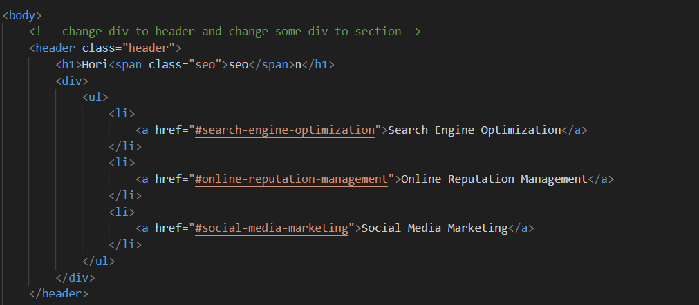
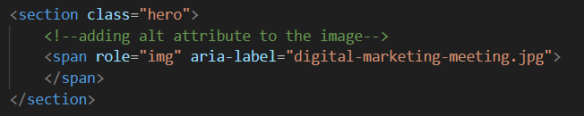
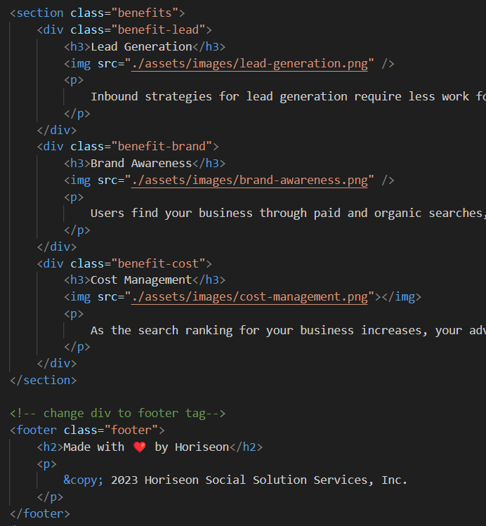
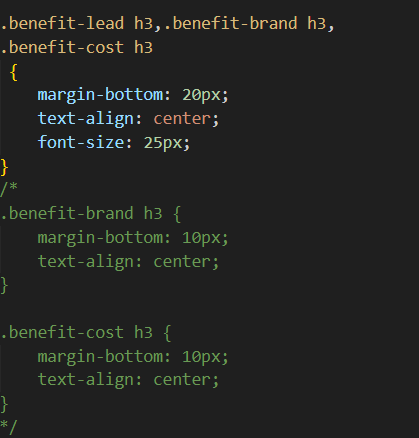
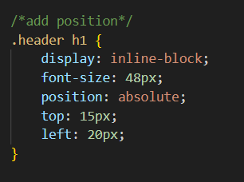

# Horiseon Company Websit 

## Description

- What was your motivation? I want to learn and practice how to modify HTML, CSS and improve the quality for website 
- Why did you build this project? I build this project for accessibility people can used
- What problem does it solve?
1- I solved many problem like: I move index.html,css file and image files to the main branch on github repository and move them from develop folder
2- I added some semantic HTML elements and I added header, footer,section and span 
3- I find some the elements doesnt follow a logical structure independent of styling and positioning like some classes has the same output so I organize them   
4- I added accessible alt attribute for the background image using span tag and aria-label properties 
5- I add a header for webpage and a title with description about horiseon company 

- What did you learn? I learn alot about HTML and CSS attribut and how to do many things for marging ,boarding,padding, CSS selectors and HTML tags, 

## Installation

N/A

## Usage
when open the webpage , there is a menu on the right side and when you click any one goes direct where the information details for it 
I include pictue to show how I change the code for HTML and CSS to make page works better for accessible people
to used 

image one : adding header tag

image two : adding alt attribute to the picture

image three: adding sections 

image four: collect three classes in one group classes to make the code shorterv and easy to read

image five: adding position to the item for main menu to avoid from moving outside the header

## Credits

N/A

## License

Please refer to the LICENSE in the repo.